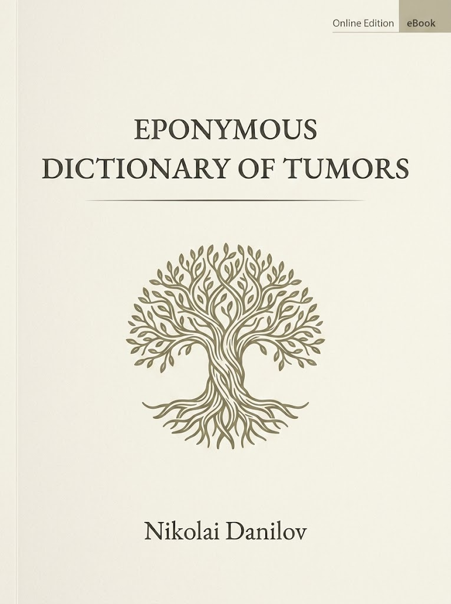
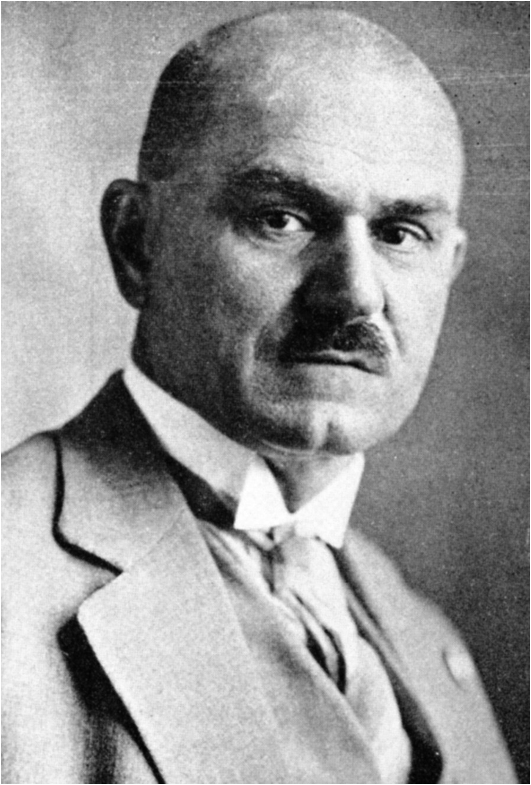

::: {.columns}

::: {.column width="48%"}

:::

::: {.column width="4%"}

:::

::: {.column width="48%"}
**© 2026 Nikolai Danilov (@DocNikDS). All rights reserved.**

First digital edition (v. 1.0) published on 21 August 2026.

**DOI:** [https://doi.org/10.5281/zenodo.22050867](https://doi.org/10.5281/zenodo.22050867)

This book was written in *RStudio* using *Quarto*. The present HTML version is hosted on *Posit Connect Cloud* at [EpoDicTum](https://docnikds-epodictum.share.connect.posit.cloud/) and is automatically updated after every commit. A print-ready PDF version will be available through *Amazon Kindle Direct Publishing*.
:::

:::

\newpage

# Preface

The ***Eponymous Dictionary of Tumors (EpoDicTum)*** is a historical-medical dictionary devoted to eponymous entities that have entered the language of oncology. It is intended for oncologists, pathologists, cancer epidemiologists, onco data scientists, historians of medicine, medical linguists, and other specialists or students who need a compact, reliable guide to the prominent scientific figures behind the popular or semi-forgotten clinical terms.

The dictionary uses the word ***"tumor"*** in a deliberately broad, etymological, traditional sense: not only malignant and benign neoplasms, but also non-neoplastic space-occupying lesions (e.g., *Pott puffy tumor*).

**Scope and selectivity**

*EpoDicTum* is intentionally selective. It includes only those eponyms that belong explicitly and recognizably to the core domain of oncology, though in its broadest sense. Eponyms that belong primarily to other disciplines, or that are only loosely connected with tumors, are not included unless their tumor connection is central.

**Congenital/hereditary syndromes**

Neoplasia is primarily a mutation-driven, genetic phenomenon. Therefore, it is not surprising that many genetic clinical syndromes are associated with increased morbidity from benign or malignant tumors. Nevertheless, in this dictionary, hereditary and congenital syndromes are not included merely because they carry an increased oncological risk; they are included only when the neoplastic predisposition is a defining, cardinal feature of the syndrome — not an associated or "notable" risk, however important its tumor association may be in clinical practice. This rule keeps the dictionary focused on tumors as the core of the eponym.

**Dates and places**

Birth and death dates are given according to the Gregorian calendar only — an issue especially relevant for figures from, e.g., the former Russian Empire, where the Julian calendar (the "Old Style") was in official use until 1918, thus creating a calendar discrepancy with the Western world for centuries.

Whenever possible, the places of birth and death of a person are given along with their dates. The names of those cities, towns, villages, etc. and their administrative belonging are given according to today's state borders, officially recognized by international law (e.g., *Bratislava, Slovakia*, not *Pressburg, Austrian-Hungarian Empire*).

**Personal identity**

A person's origin and professional identity are stated neutrally and very briefly. *EpoDicTum* follows, wherever feasible, both an ethnic and modern nation-state approach (e.g., *Jewish American physician*). Although this may sound anachronistic, it provides a consistent practical framework for categorizing historical figures in a way that is accessible to contemporary readers and avoids shifting attention and credit from national to imperial identities, thus preserving cultural diversity as opposed to the earlier imperial-colonial generalization.

**Alphabetization and particles**

In *EpoDicTum*, possessive case (*'s*) or nobiliary prefix particles in complex surnames (e.g., *de*, *d'*, *di*, *von*, *van*, etc.) are disregarded in both the entry headings and the alphabetical order of surnames in the Index of personalia. Thus, to locate a dictionary entry, one should search by the core surname itself (e.g., *ROKITANSKY*, not *VON ROKITANSKY*).

**Hyphenation of given names**

In this dictionary, all component elements of a person's given name are connected with hyphens (e.g., *Jean-Octave-Albert Demons*) rather than left as separate words. This is adopted as a deliberate editorial measure to eliminate any ambiguity between complex given names and surnames — a problem that arises frequently in multilingual historical sources and can be especially acute when a surname resembles a given name. This hyphenation follows a convention observed in traditional French scholarly texts and is applied uniformly throughout the volume, in the service of clarity and the precise identification of the individuals honored by the eponyms.

**Images**

Unless otherwise noted, the images in this dictionary are used under *Public Domain or Creative Commons Zero (PD/CC0)* licenses. We gratefully acknowledge the contributors to repositories for supporting global open-access education.

**Feedback from readers**

This is an evolving digital-publishing project, and with your help we can make it even better. Your feedback, proposals for improvement, or other relevant terms that are not yet included in the current version of *EpoDicTum* are welcome at the compiler's email: ***danilov.md@gmail.com***. All feedback is kept private, but you can choose to leave your real name and affiliation so we can mention you in our Acknowledgements section. Thank you for helping make this book an even more valuable reference resource for our readers' community.

**Abbreviations used**

*b.*: born

*Syn.*: synonym(s)

\newpage

# A

## ABRIKOSSOFF [ABRIKOSOV]

{.portrait}
***Aleksey Ivanovich Abrikossoff [Abrikosov]*** (18 Jan 1875, Moscow, Russia - 9 Apr 1955, Мoscow, Russia) - Russian pathologist.

### Abrikossoff tumor

Syn.: granular cell tumor. Benign neoplasm of skin.

\newpage

# B

## BRENNER

{.portrait}
***Fritz Brenner*** (16 Dec 1877, Osthofen, Germany – 26 Dec 1969, Johannesburg, South Africa) - German physician and pathologist.

### Brenner tumor

Generally benign ovarian epithelial neoplasm.

\newpage

# C

## CALL

### Call-Exner bodies

\newpage

## COLEY

### Coley toxins

Syn.: Coley vaccine.

\newpage

# D

## DEMONS

Jean-Octave-Albert Demons (1842-1920)

### Demons-Meigs syndrome

\newpage

# E

## EXNER

### Call–Exner bodies

See CALL

\newpage

# F

\newpage

# G

\newpage

# H

\newpage

# I

\newpage

# J

\newpage

# K

\newpage

## KRUKENBERG

### Krukenberg tumor

\newpage

# L

## LEYDIG

### Leydig cell tumor

### Leydig-Sertoli cell tumor

\newpage

# M

## MAFFUCCI

### Maffucci syndrome

\newpage

## MEIGS

{.portrait}
Joe Vincent Meigs (1892-1963)

### Demons-Meigs syndrome

See DEMONS

\newpage

## MERKEL

### Merkel cell carcinoma

\newpage

# N

\newpage

# O

## OLLIER

### Ollier disease

\newpage

# P

## PERLMAN

### Perlman syndrome

\newpage

## POTT

Percivall Pott (6 Jan 1714, London, UK – 22 December 1788) - English surgeon.

### Pott puffy tumor

\newpage

# Q

\newpage

# R

## REINKE

### Reinke crystalloids

\newpage

## ROSEN

### Simpson–Golabi–Behmel syndrome (SGBS)

Syn.: Golabi-Rosen syndrome. See BEHMEL.

\newpage

# S

## SERTOLI

### Leydig-Sertoli cell tumor

See LEYDIG.

\newpage

## SCHWANN

### Schwannoma

Also: Schwann cells.

\newpage

# T

\newpage

# U

\newpage

# V

\newpage

# W

## WARTHIN

{.portrait}
***Aldred Scott Warthin*** (21 Oct 1866, Greensburg, Indiana, US - 23 May 1931, Ann Arbor, Michigan, US) - American pathologist, the father of cancer genetics.

### Warthin tumor

Syn.: cystadenoma lymphomatosum papilliferum; [cyst]adenolymphoma. Benign neoplasm of major salivary glands, predominantly the parotid gland.

\newpage

## WERNER

### Werner syndrome

\newpage

## WILMS

### Wilms tumor

\newpage

# X

\newpage

# Y

\newpage

# Z

\newpage

# Index of personalia
