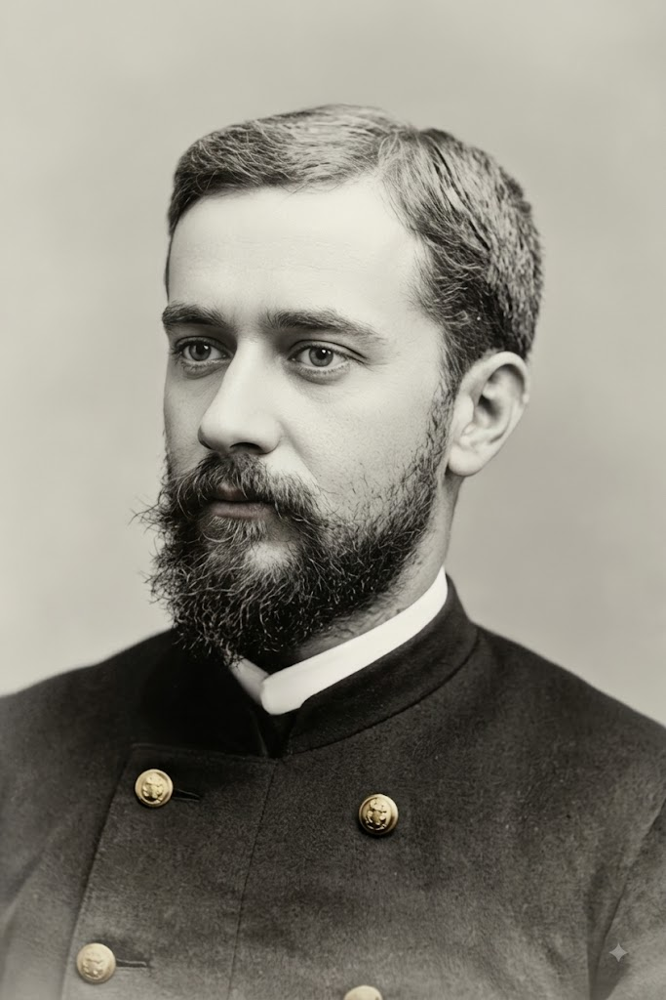
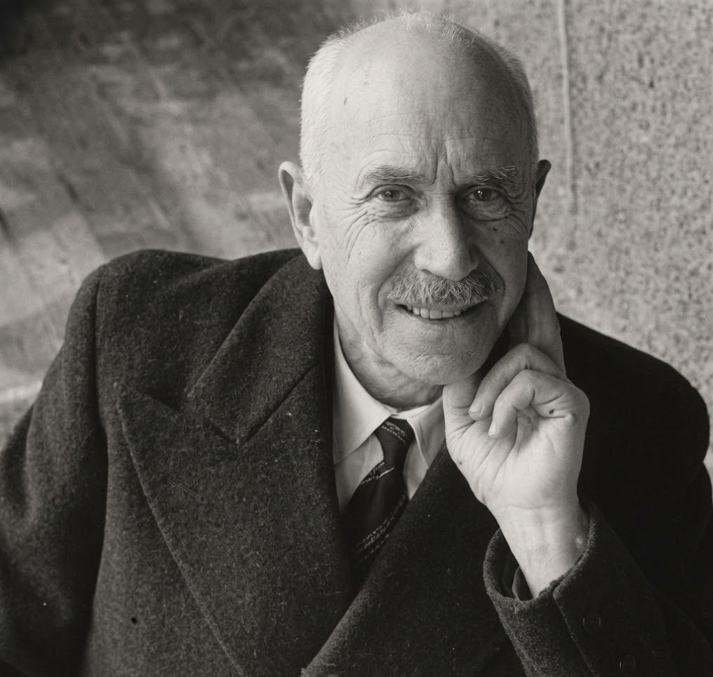

# A

# B

# C

CALMETTE
--------

Léon Charles Albert Calmette (12 Jul 1863, Nice, France – 29 Oct 1933, Paris, France) - French physician, bacteriologist, and immunologist. 

### Bacillus Calmette-Guérin (BCG) vaccine

A vaccine made of attenuated *Mycobacteria bovis* and indicated in the prevention of tuberculosis and the treatment of non-invasive urothelial bladder cancer.  

# D

# E

# F

# G

GHON
----

### Ghon focus (lesion) 

### Ghon complex

GUÉRIN
------

### Bacillus Calmette-Guérin (BCG) vaccine

See CALMETTE.

# H

# I

# J

# K

KOCH
----

***Heinrich Hermann Robert Koch*** (1843-1910) - German physician and bacteriologist.

### Koch bacillus

Syn.: *Mycobacterium tuberculosis*. Aerobic weakly Gram-positive bacterium, proved by R. Koch (1882) to be the causative agent of tuberculosis. 

### Koch postulates

Four-stage experimental protocol requiring (1) microbial presence in all diseased hosts, (2) isolation in pure culture, (3) reproduction of disease in a healthy host, and (4) re-isolation of the identical agent - to establish a specific pathogen as the causative source of a disease.

# L

# M

MANTOUX
-------

 

***Charles Mantoux*** (14 May 1877, Paris, France - 3 May 1947, Le Cannet, France) - French physician.

### Mantoux-Mendel test

Syn.: tuberculin sensitivity test; PPD test. A method consisting of an intradermal injection of purified protein derivative (PPD) tuberculin, used to screen for tuberculosis infection.

MENDEL
------

Felix Mendel (2 Mar 1862, Essen, Germany - 19 Dec 1925) - Jewish German physician.

### Mantoux-Mendel test

See MANTOUX.

# N

# O

# P

POTT
----

Percivall Pott (6 Jan 1714, London, UK – 22 December 1788) - English surgeon.

### Pott disease

Syn.: tuberculous spondylitis.

# Q

# R

# S

# T

# U

# V

# W

# X

# Y

# Z