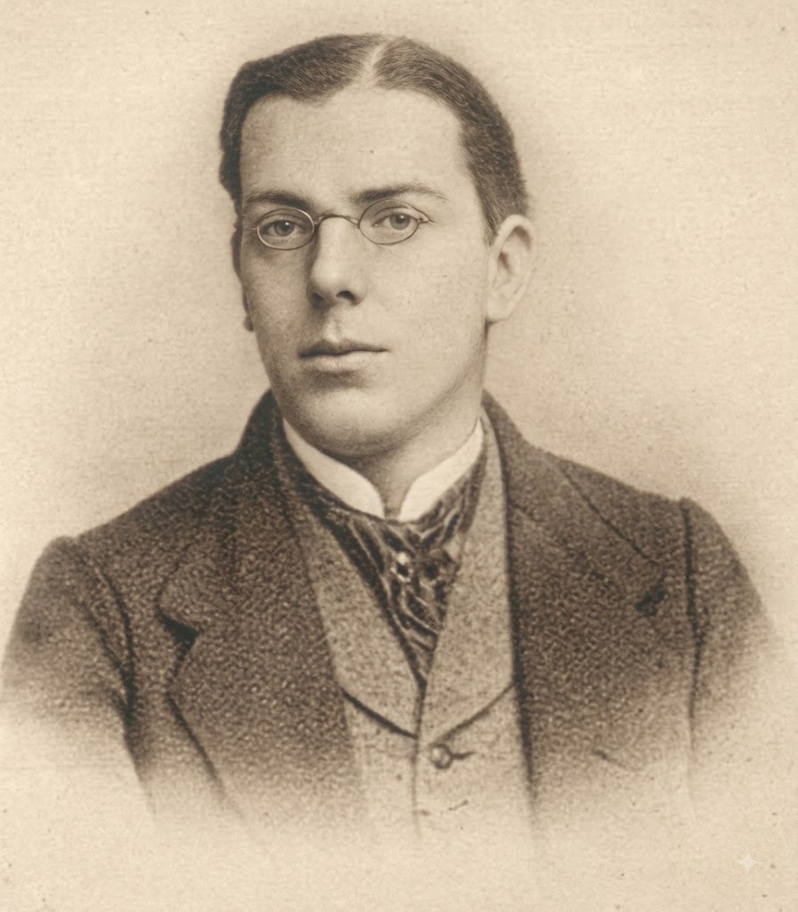

# A

# B

# C

### Calmette-Guérin bacillus (BCG)

# D

# E

# F

# G

GHON
----

### Ghon focus (lesion) 

### Ghon complex

# H

# I

# J

# K

KOCH
----

***Heinrich Hermann Robert Koch*** (1843-1910) - German physician and bacteriologist.

### Koch bacillus

Syn.: Mycobacterium tuberculosis. Aerobic weakly Gram-positive bacterium, proved by R. Koch (1882) to be the causative agent of tuberculosis. 

### Koch postulates

Four-stage experimental protocol requiring (1) microbial presence in all diseased hosts, (2) isolation in pure culture, (3) reproduction of disease in a healthy host, and (4) re-isolation of the identical agent - to establish a specific pathogen as the causative source of a disease.

# L

# M

# N

# O

# P

# Q

# R

# S

# T

# U

# V

# W

# X

# Y

# Z