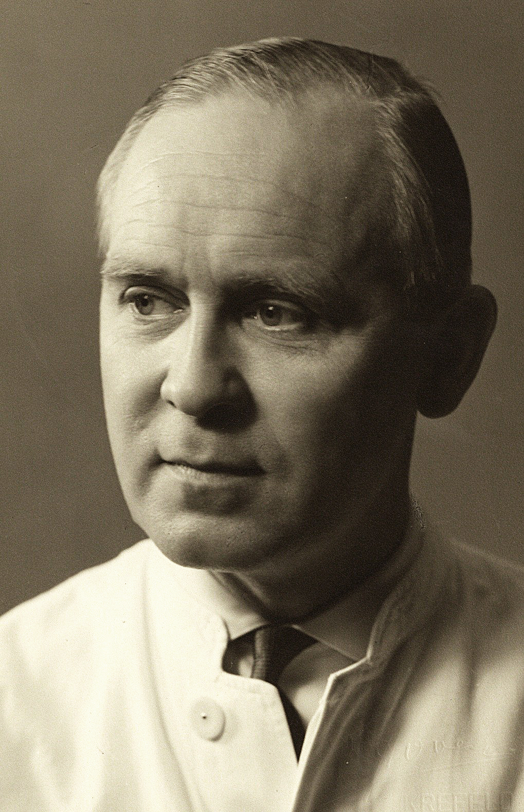

# A

ABRIKOSSOFF [ABRIKOSOV]
-----------------------

***Aleksey Ivanovich Abrikossoff [Abrikosov]*** (18 Jan 1875, Moscow, Russia - 9 Apr 1955, Мoscow, Russia) - Russian pathologist.

### Abrikossoff tumor

Syn.: granular cell tumor. Benign neoplasm of skin.

# B

BECKWITH
--------

***John Bruce Beckwith*** (18 Sep 1933, Spokane, WA, US – 21 Jan 2025, Missoula, MT, US) - American pathologist. 

### Beckwith-Wiedemann syndrome

Syn.: exomphalos-macroglossia-gigantism syndrome. Congenital, mostly sporadic, overgrowth syndrome, characterized notably by an increased risk of embryonal tumors in childhood. 

BEHMEL
------

***Annemarie Behmel*** (Graz, Austria) - Austrian geneticist.

### Simpson–Golabi–Behmel syndrome (SGBS)

Syn.: Golabi-Rosen syndrome; Simpson dysmorphia syndrome (SDYS); X-linked dysplasia-gigantism syndrome (DGSX). Congenital hereditary overgrowth syndrome characterized notably by embryonal tumors.

BRENNER
-------

### Brenner tumor

# C

CALL
----

### Call-Exner bodies

COLEY
-----

### Coley toxins

Syn.: Coley vaccine.

# D

DEMONS
------

Jean-Octave-Albert Demons (1842-1920)

### Demons-Meigs syndrome

# E

EXNER
-----

### Call–Exner bodies

See CALL

# F

# G

GOLABI
------

### Simpson–Golabi–Behmel syndrome (SGBS)

Syn.: Golabi-Rosen syndrome. See BEHMEL

# H

# I

# J

# K

KRUKENBERG
----------

### Krukenberg tumor

# L

LEYDIG
------

### Leydig cell tumor

### Leydig-Sertoli cell tumor

# M

MAFFUCCI
--------

### Maffucci syndrome

MEIGS
-----

Joe Vincent Meigs (1892-1963)

### Demons-Meigs syndrome

See DEMONS

MERKEL
------

### Merkel cell carcinoma

# N

# O

OLLIER
------

### Ollier disease

# P

PERLMAN
-------

### Perlman syndrome

POTT
----

Percivall Pott (6 Jan 1714, London, UK – 22 December 1788) - English surgeon.

### Pott puffy tumor

PROTEUS
-------

### Proteus syndrome

Syn.: Wiedemann syndrome. Partial gigantism-nevi-hemihypertrophy-macrocephaly syndrome. Overgrowth syndrome characterized, among other features, by some benign neoplasms (hemangiomas, lymphangiomas, lipomas, and epidermal nevi).

# Q

# R

REINKE
------

### Reinke crystalloids

ROSEN
-----

### Simpson–Golabi–Behmel syndrome (SGBS)

Syn.: Golabi-Rosen syndrome. See BEHMEL.

# S

SERTOLI
-------

### Leydig-Sertoli cell tumor

See LEYDIG

SCHWANN
-------

### Schwannoma

Also: Schwann cells.

SIMPSON
-------

Joe Leigh Simpson (b. 1943) - geneticist.

### Simpson–Golabi–Behmel syndrome (SGBS)

Syn.: Simpson dysmorphia syndrome (SDYS). See BEHMEL.

# T

# U

# V

# W

WARTHIN
-------

***Aldred Scott Warthin*** (21 Oct 1866, Greensburg, Indiana, US - 23 May 1931, Ann Arbor, Michigan, US) - American pathologist, the father of cancer genetics.

### Warthin tumor

Syn.: cystadenoma lymphomatosum papilliferum; [cyst]adenolymphoma. Benign neoplasm of major salivary glands, predominantly the parotid gland.

WERNER
------

### Werner syndrome

WIEDEMANN
---------

Hans-Rudolf Wiedemann (16 Feb 1915, Bremen, Germany – 4 Aug 2006, Kiel, Germany) - German pediatrician. 

### Beckwith-Wiedemann syndrome

See BECKWITH

### Wiedemann syndrome

See PROTEUS

WILMS
-----

### Wilms tumor

# X

# Y

# Z