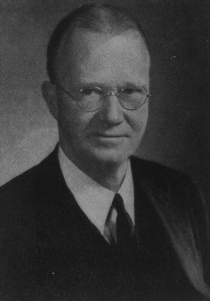
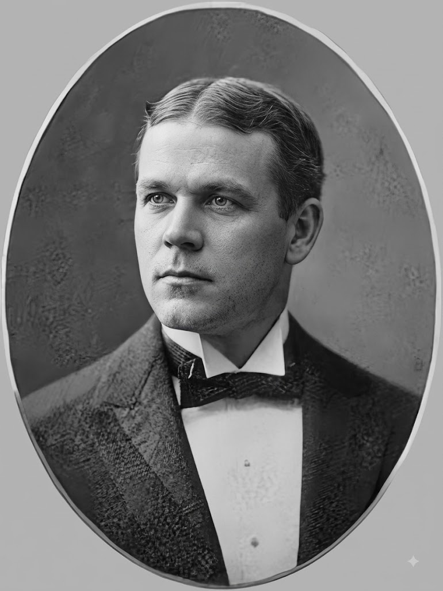

# A

# B

BECKWITH
--------

### Beckwith-Wiedemann syndrome

BEHMEL
------

### Behmel-Golabi-Rosen-Simpson syndrome

Syn.: *Sara Agers syndrome.

BRENNER
-------

### Brenner tumor

# C

CALL
----

### Call-Exner bodies

# D

DEMONS
------

Jean-Octave-Albert Demons (1842-1920)

### Demons-Meigs syndrome

# E

EXNER
-----

### Call–Exner bodies

See CALL

# F

# G

GOLABI
------

### Behmel-Golabi-Rosen-Simpson syndrome

See BEHMEL

# H

# I

# J

# K

KRUKENBERG
----------

### Krukenberg tumor

# L

LEYDIG
------

### Leydig cell tumor

### Leydig-Sertoli cell tumor

# M

MAFFUCCI
--------

### Maffucci syndrome

MEIGS
-----

Joe Vincent Meigs (1892-1963)

### Demons-Meigs syndrome

See DEMONS

MERKEL
------

### Merkel cell carcinoma

# N

# O

OLLIER
------

### Ollier disease

# P

PERLMAN
-------

### Perlman syndrome

PROTEUS
-------

### Proteus syndrome

Syn.: Wiedemann syndrome. 

# Q

# R

REINKE
------

### Reinke crystalloids

ROSEN
-----

### Behmel-Golabi-Rosen-Simpson syndrome

See BEHMEL

# S

SERTOLI
-------

### Leydig-Sertoli cell tumor

See LEYDIG

SIMPSON
-------

### Behmel-Golabi-Rosen-Simpson syndrome

See BEHMEL

# T

# U

# V

# W

WARTHIN
-------

***Aldred Scott Warthin*** (21 Oct 1866, Greensburg, Indiana, US - 23 May 1931, Ann Arbor, Michigan, US) - American pathologist, the father of cancer genetics.

### Warthin tumor

Syn.: cystadenoma lymphomatosum papilliferum; [cyst]adenolymphoma. Benign neoplasm of major salivary glands, predominantly the parotid gland. 

WIEDEMANN
---------

### Beckwith-Wiedemann syndrome

See BECKWITH

### Wiedemann syndrome

See PROTEUS

WILMS
-----

### Wilms tumor

# X

# Y

# Z